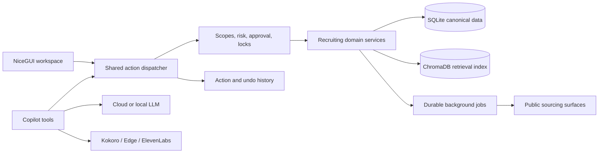

<div align="center">

# TalentHunt OS

**The local-first, Copilot-first operating system for talent sourcing and recruiting.**

[](https://www.python.org/)
[](https://nicegui.io/)
[](#project-status)
[](#data-and-privacy)
[](#the-control-model)

[Quick start](#quick-start) · [Recruiting workflow](#recruiting-workflow) · [Local Copilot](#embedded-local-copilot) · [Architecture](#architecture) · [Quality](#testing) · [Docs](#documentation)

</div>

TalentHunt OS brings sourcing, candidate records, Hunt pipelines, communications,
analytics, and recruiting operations into one private workspace. Its Copilot is not a
second system bolted onto the UI: it requests the same typed actions, approvals, history,
and Undo paths used by the product itself.

> [!IMPORTANT]
> TalentHunt OS is under active development. Core recruiting workflows are usable, but
> full Copilot parity, communications automation, and release hardening are not complete.
> Review the [Copilot-first roadmap](docs/COPILOT_FIRST_ROADMAP.md) before production use.

## Recruiting Workflow

| Stage | What TalentHunt does | Why it matters |
| --- | --- | --- |
| Define | Creates Talent Hunts with role, location, experience, skills, sources, and a Kanban pipeline. | Every sourcing decision has a clear role context. |
| Discover | Runs cancellable, durable sourcing work across configured public result surfaces. Discoveries and Common Pool preserve useful identities, including filtered and rejected results. | Search work is retained without inflating active Candidate counts. |
| Review | Keeps one canonical Candidate record with profile evidence, experience timeline, education, skills, notes, source provenance, and resume imports. | Dashboard, Candidate, Hunt, and Pipeline metrics all derive from the same data. |
| Decide | Moves candidates through the pipeline, merges duplicates, supports candidate intake, and calculates experience from non-overlapping date intervals. | Recruiter decisions are evidence-led and consistent across views. |
| Act | Drafts communications, records provider receipts, creates CSV/XLSX/PDF reports, and lets Copilot request registered actions. | Operational work is traceable instead of disappearing into chat. |

Normal Copilot chat remains available while sourcing and enrichment run in the background.
Only a conflicting search is blocked, and the active job remains visible with cancellation,
retry, and restart reconciliation.

## The Control Model

TalentHunt is designed for recruiting work that has consequences:

- **One source of truth:** SQLite is authoritative for Candidates, Hunts, pipeline state,
  approvals, and action history. ChromaDB is a rebuildable retrieval index, never the
  source of permissions or counts.
- **Guarded actions:** UI commands and Copilot tools share a typed action dispatcher with
  input validation, scopes, risk levels, resource locks, idempotency, and durable results.
- **Human approval:** Bulk, destructive, credential-related, and external actions require
  an explicit confirmation appropriate to the risk. A chat response alone does not count
  as successful execution.
- **Recoverable local work:** Supported local mutations create Action History records and
  expose exact seven-day Undo. External sends and other irreversible operations retain a
  receipt instead of pretending they can be undone.
- **Local by default:** the application, bundled model server, reports, and recruiter data
  stay on the local machine and bind to loopback.

## Architecture



The action registry is the control plane. Each registered action declares typed input,
required scope, risk level, resource locks, idempotency behavior, and an inverse or
compensation policy. UI handlers and Copilot adapters are progressively being migrated to
this shared path.

For maintained domain rules and data-flow details, read
[Application Logic](docs/APP_LOGIC.md).

## Quick Start

### Requirements

- Windows with PowerShell
- Python 3.12 or newer
- [uv](https://docs.astral.sh/uv/getting-started/installation/)
- Git

### Install

```powershell
git clone https://github.com/Saurabh682/TalentHuntOS.git
cd TalentHuntOS
.\scripts\setup.ps1
```

The setup script creates the project `.venv` from `uv.lock` and installs Playwright
Chromium. It does not modify global Python packages. To skip the browser download:

```powershell
.\scripts\setup.ps1 -SkipBrowser
```

### Run

```powershell
uv run python -m app.main
```

Open **[http://127.0.0.1:8080/](http://127.0.0.1:8080/)**. TalentHunt OS deliberately
rejects non-loopback hosts and ports other than `8080` because it contains private
recruiting data.

### First Run

1. Open the local address above and create the first recruiter account. Passwords must be
   at least 12 characters and can be shown or hidden while typing.
2. Create a Hunt, then set the target role, location, experience band, skills, and sources.
3. Use **Discoveries** to review the retained pool before approving a profile into the
   canonical Candidate database.
4. Open the Copilot with a Hunt selected for context-aware work. Sensitive actions state
   their scope and wait for confirmation.

## Embedded Local Copilot

TalentHunt can run Copilot without LM Studio, Ollama, an API key, an account, or a paid
service. In **Settings → Embedded Local Copilot**, choose Lite or Standard and select
**Install**. The first installation downloads the verified IBM Granite 4.1 3B Q4_K_M model
once, checks its pinned size and SHA-256 hash, stores it in the private data directory, and
starts the bundled llama.cpp server on `127.0.0.1`.

- The download is about 2.1 GB and can be cancelled or retried.
- The embedded model requires at least 6 GB total RAM; Lite is recommended below 12 GB.
- External loopback servers and optional cloud providers remain available alternatives.
- The model can request actions, but it cannot bypass approvals, action history, Undo,
  scopes, or resource locks.

## Configuration

Most provider and voice settings can be managed from the Settings page. Optional values
may also be placed in a root `.env` file:

```dotenv
GEMINI_API_KEY=
OPENAI_API_KEY=
ANTHROPIC_API_KEY=
DEEPGRAM_API_KEY=
ELEVENLABS_API_KEY=

TTS_PROVIDER=kokoro
TTS_KOKORO_VOICE=af_heart
TTS_EDGE_VOICE=en-US-JennyNeural

LLAMA_SERVER_HOST=127.0.0.1
LLAMA_SERVER_PORT=1234
EMBEDDED_AI_PORT=18081
LOCAL_AI_MODE=standard
LOCAL_AI_AUTOSTART=true
TALENTHUNT_DATA_DIR=./data
```

`EMBEDDED_AI_PORT` is reserved for TalentHunt's bundled llama.cpp runtime.
`LLAMA_SERVER_HOST` and `LLAMA_SERVER_PORT` are used only in External mode for
LM Studio or another loopback OpenAI-compatible server. TalentHunt never stops or
takes ownership of that external process.

Cloud AI and paid voice keys are optional. SMTP/IMAP credentials and connected-site
sessions are encrypted locally and should be entered through Settings, not committed to
source control.

## Password Recovery

Passwords are hashed and cannot be displayed or recovered. If the local administrator
password is forgotten, stop the app and run the local recovery command:

```powershell
uv run talenthunt-reset-password
```

The reset changes authentication credentials without deleting Candidates, Hunts, or app
settings. Password reset is intentionally unavailable as an ordinary Copilot action.

## Testing

Run the complete suite:

```powershell
uv run pytest
```

Focused action-kernel and recruiting parity tests live in `tests/test_action_kernel.py`,
`tests/test_pipeline_actions.py`, `tests/test_hunt_actions.py`, and the related Candidate,
Discovery, job, security, and end-to-end test modules.

Install and run the local development checks:

```powershell
uv sync --group dev
uv run ruff check app tests scripts --select E9,F63,F7,F82
uv run pytest --cov=app --cov-report=term-missing
```

See [Local Quality Workflow](docs/QUALITY.md) for review-only security and dependency
audits, broader Ruff debt reports, local accessibility verification, and loopback Mailpit
testing.

## Documentation

| Document | Use it for |
| --- | --- |
| [Application Logic](docs/APP_LOGIC.md) | Canonical data ownership, recruiting rules, action behavior, and operational contracts. |
| [Copilot Capability Audit](docs/COPILOT_CAPABILITY_AUDIT.md) | What the Copilot can currently do, what is intentionally gated, and what remains. |
| [Copilot-First Roadmap](docs/COPILOT_FIRST_ROADMAP.md) | Delivery stages, safety boundaries, and exit criteria. |
| [Design Contract](DESIGN.md) | UI, responsive, accessibility, and Copilot interaction rules. |
| [Quality Workflow](docs/QUALITY.md) | Local tests, security checks, accessibility audit, and optional Mailpit verification. |
| [Dependency Security Decisions](docs/DEPENDENCY_SECURITY.md) | Reviewed dependencies, known advisory boundary, local model provenance, and re-review dates. |

## Data And Privacy

By default, runtime data is stored under `data/`; `TALENTHUNT_DATA_DIR` can relocate it.
SQLite is authoritative. ChromaDB is a replaceable semantic retrieval index and must not
be treated as the source of permissions, counts, or transactional state.

Use sourcing and connected-site features only where you have authorization and in
accordance with each site's terms, robots policy, privacy obligations, and applicable law.
TalentHunt OS does not make third-party access permissible by itself.

## Project Status

Completed foundations include the shared action kernel, scoped approvals, idempotency,
resource locks, structured tool-call records, durable sourcing and enrichment jobs,
Candidate/Common Pool actions, duplicate merge and Undo, Pipeline parity, and Hunt
lifecycle parity. Core Playbook and Candidate Intake actions also share the UI/Copilot
dispatcher with audited seven-day Undo for reversible writes. Communications local management
and SMTP email delivery now share the same action kernel; every external send requires an exact
R4 approval and records a non-undoable provider receipt.
Copilot and the UI also share bounded durable-job history, exact status, one-job
cancellation, and immutable linked Retry for sourcing, approved-profile enrichment, and
connected-site browser work. Connected-site status, visible-browser login/reconnect, verification,
exact-job Save, and approval-gated Disconnect now use the same secret-safe action contracts in
Settings and Copilot.
Analytics reads and CSV/XLSX/PDF report creation also share canonical services and registered
actions. Report files stay in a bounded local directory and are exposed only through
authenticated artifact-ID downloads with stored provenance and integrity checks.
Embedded local AI status, installation, configuration, startup, shutdown, cancellation,
and Retry now share five generated Copilot actions with the Settings UI. The app bundles
the complete verified llama.cpp runtime; model installation remains an explicit cancellable
first-run job, and configuration has seven-day Undo.

The next roadmap areas are TTS preference actions, richer Playbook/Intake administration,
multi-step Copilot plans, and
release hardening. See the maintained
[Copilot-First Roadmap](docs/COPILOT_FIRST_ROADMAP.md) for exit gates and current detail.

## Repository Guide

| Path | Purpose |
| --- | --- |
| `app/actions/` | Typed action registry, dispatch, approvals, locks, history, and Undo |
| `app/copilot/` | Chat orchestration, generated tools, sessions, and streaming responses |
| `app/candidates/` | Canonical profiles, discoveries, Common Pool, intake, and resume import |
| `app/hunts/` | Hunts, sourcing, durable jobs, pipeline, and playbook logic |
| `app/communications/` | Outreach records and encrypted email transport boundaries |
| `app/ui/` | NiceGUI pages, panels, components, and visual action controls |
| `DESIGN.md` | Original visual, responsive, accessibility, and Copilot interaction contract |
| `docs/APP_LOGIC.md` | Maintained product and domain behavior reference |
| `docs/ACCESSIBILITY.md` | Automated and manual UI verification procedure |
| `docs/ARCHITECTURE_PATTERNS.md` | Patterns already justified by product behavior |
| `docs/COPILOT_CAPABILITY_AUDIT.md` | Page-by-page Copilot connection coverage and missing actions |
| `docs/COPILOT_FIRST_ROADMAP.md` | Capability audit, safety model, and delivery roadmap |
| `docs/COMPARABLE_PLATFORM_REVIEW.md` | Audited recruitment-platform references and adoption boundaries |
| `docs/DEPENDENCY_SECURITY.md` | Reviewed dependency advisories and compensating controls |
| `docs/QUALITY.md` | Free, local, review-first engineering checks |
| `tests/` | Unit, integration, security, parity, and end-to-end tests |

## Contributing

1. Create a focused branch from the current development branch.
2. Keep UI and Copilot mutations behind the shared action dispatcher.
3. Add a risk classification, audit behavior, and tested Undo for reversible writes.
4. Update `docs/APP_LOGIC.md` when domain behavior changes.
5. Run the relevant focused tests and the full suite before opening a pull request.

Bug reports and focused pull requests are welcome. Please avoid including real candidate
data, credentials, browser sessions, database files, or generated runtime artifacts.
