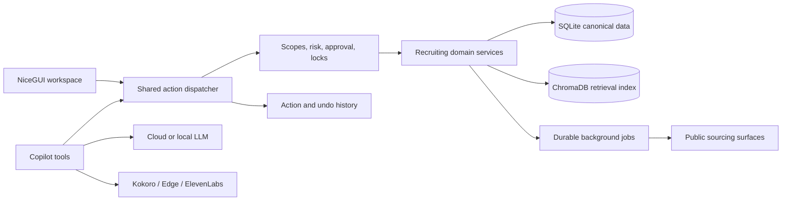

<div align="center">

# TalentHunt OS

**A local-first, Copilot-first operating system for talent sourcing and recruiting.**

[](https://www.python.org/)
[](https://nicegui.io/)
[](#project-status)


</div>

TalentHunt OS brings sourcing, candidate records, Hunt pipelines, communications,
analytics, and recruiting operations into one private workspace. Its Copilot is an
operating surface over the same typed actions used by the UI, with approvals for risky
changes, durable execution records, and seven-day Undo for supported local mutations.

> [!IMPORTANT]
> TalentHunt OS is under active development. Core recruiting workflows are usable, but
> full Copilot parity, communications automation, and release hardening are not complete.
> Review the [Copilot-first roadmap](docs/COPILOT_FIRST_ROADMAP.md) before production use.

## What It Does

- **Talent Hunts** organize a role, location, experience target, skills, search sources,
  and a configurable Kanban pipeline.
- **Asynchronous sourcing** searches LinkedIn, Naukri, GitHub, Behance, ArtStation, and
  Dribbble result surfaces in parallel, with durable progress, cancellation, retry, and
  restart reconciliation.
- **Discoveries and Common Pool** retain every useful identity found during sourcing,
  including filtered and rejected results, without inflating active Candidate counts.
- **Canonical Candidates** are the single source of truth for Dashboard, Candidate,
  Hunt, and Pipeline views.
- **Structured profiles** store experience, education, skills, notes, source provenance,
  resume imports, and profile evidence. Experience totals are calculated from timeline
  intervals instead of summing overlapping jobs.
- **Candidate Intake** creates tokenized forms and applies reviewed submissions to the
  canonical profile.
- **Recruiting Copilot** can query records and execute registered OS actions while normal
  chat remains available during background sourcing.
- **Action History** records typed mutations and provides exact seven-day Undo where a
  local operation is genuinely reversible.
- **Analytics reports** create canonical CSV, XLSX, and PDF artifacts through the same
  registered actions used by Copilot, with provenance and authenticated local downloads.
- **Voice** supports local Kokoro TTS, Microsoft Edge neural TTS, browser speech, optional
  ElevenLabs TTS, and optional Deepgram STT.
- **Communications** supports encrypted local SMTP account configuration, connection
  testing, drafting, exact R4 send approval, duplicate protection, provider receipts, and
  communication logs. IMAP inbox sync is still planned; the current inbox adapter returns
  no synthetic messages.
- **Embedded Local AI** bundles a pinned llama.cpp runtime and can install the verified
  IBM Granite 4.1 3B Q4_K_M model with one click. After the first model download it needs
  no LM Studio, Ollama, API key, account, paid service, or internet connection. External
  loopback servers and cloud providers remain optional.

## Core Principles

1. **Copilot-first, not Copilot-only.** Pages visualize the same domain actions available
   to the assistant.
2. **One source of truth.** Candidate and pipeline metrics derive from canonical database
   records, not cached UI counters.
3. **Human control at consequential boundaries.** Sensitive, bulk, external, and secret
   operations require stronger approval than ordinary chat text.
4. **Honest execution.** The Copilot reports completed work only after the underlying
   action or provider returns a real result.
5. **Local by default.** The application binds only to loopback and stores recruiter data
   in the configured local data directory.

## Architecture



The action registry is the control plane. Each registered action declares typed input,
required scope, risk level, resource locks, idempotency behavior, and an inverse or
compensation policy. UI handlers and Copilot adapters are progressively being migrated to
this shared path.

For maintained domain rules and data-flow details, read
[Application Logic](docs/APP_LOGIC.md).

## Quick Start

### Requirements

- Windows with PowerShell
- Python 3.12 or newer
- [uv](https://docs.astral.sh/uv/getting-started/installation/)
- Git

### Install

```powershell
git clone https://github.com/Saurabh682/TalentHuntOS.git
cd TalentHuntOS
.\scripts\setup.ps1
```

The setup script creates the project `.venv` from `uv.lock` and installs Playwright
Chromium. It does not modify global Python packages. To skip the browser download:

```powershell
.\scripts\setup.ps1 -SkipBrowser
```

### Run

```powershell
uv run python -m app.main
```

Open **[http://127.0.0.1:8080/](http://127.0.0.1:8080/)**. TalentHunt OS deliberately
rejects non-loopback hosts and ports other than `8080` because it contains private
recruiting data.

On first use, open **Settings → Embedded Local Copilot**, choose Lite or Standard, and
select **Install**. TalentHunt downloads about 2.1 GB once, verifies the pinned size and
SHA-256 checksum, stores the model in its private data directory, and starts it on
`127.0.0.1`. At least 6 GB total RAM is required; Lite is recommended below 12 GB.

## Configuration

Most provider and voice settings can be managed from the Settings page. Optional values
may also be placed in a root `.env` file:

```dotenv
GEMINI_API_KEY=
OPENAI_API_KEY=
ANTHROPIC_API_KEY=
DEEPGRAM_API_KEY=
ELEVENLABS_API_KEY=

TTS_PROVIDER=kokoro
TTS_KOKORO_VOICE=af_heart
TTS_EDGE_VOICE=en-US-JennyNeural

LLAMA_SERVER_HOST=127.0.0.1
LLAMA_SERVER_PORT=1234
EMBEDDED_AI_PORT=18081
LOCAL_AI_MODE=standard
LOCAL_AI_AUTOSTART=true
TALENTHUNT_DATA_DIR=./data
```

`EMBEDDED_AI_PORT` is reserved for TalentHunt's bundled llama.cpp runtime.
`LLAMA_SERVER_HOST` and `LLAMA_SERVER_PORT` are used only in External mode for
LM Studio or another loopback OpenAI-compatible server. TalentHunt never stops or
takes ownership of that external process.

Cloud AI and paid voice keys are optional. SMTP/IMAP credentials and connected-site
sessions are encrypted locally and should be entered through Settings, not committed to
source control.

## Password Recovery

Passwords are hashed and cannot be displayed or recovered. If the local administrator
password is forgotten, stop the app and run the local recovery command:

```powershell
uv run talenthunt-reset-password
```

The reset changes authentication credentials without deleting Candidates, Hunts, or app
settings. Password reset is intentionally unavailable as an ordinary Copilot action.

## Testing

Run the complete suite:

```powershell
uv run pytest
```

Focused action-kernel and recruiting parity tests live in `tests/test_action_kernel.py`,
`tests/test_pipeline_actions.py`, `tests/test_hunt_actions.py`, and the related Candidate,
Discovery, job, security, and end-to-end test modules.

Install and run the local development checks:

```powershell
uv sync --group dev
uv run ruff check app tests scripts --select E9,F63,F7,F82
uv run pytest --cov=app --cov-report=term-missing
```

See [Local Quality Workflow](docs/QUALITY.md) for review-only security and dependency
audits, broader Ruff debt reports, local accessibility verification, and loopback Mailpit
testing.

## Data And Privacy

By default, runtime data is stored under `data/`; `TALENTHUNT_DATA_DIR` can relocate it.
SQLite is authoritative. ChromaDB is a replaceable semantic retrieval index and must not
be treated as the source of permissions, counts, or transactional state.

Use sourcing and connected-site features only where you have authorization and in
accordance with each site's terms, robots policy, privacy obligations, and applicable law.
TalentHunt OS does not make third-party access permissible by itself.

## Project Status

Completed foundations include the shared action kernel, scoped approvals, idempotency,
resource locks, structured tool-call records, durable sourcing and enrichment jobs,
Candidate/Common Pool actions, duplicate merge and Undo, Pipeline parity, and Hunt
lifecycle parity. Core Playbook and Candidate Intake actions also share the UI/Copilot
dispatcher with audited seven-day Undo for reversible writes. Communications local management
and SMTP email delivery now share the same action kernel; every external send requires an exact
R4 approval and records a non-undoable provider receipt.
Copilot and the UI also share bounded durable-job history, exact status, one-job
cancellation, and immutable linked Retry for sourcing, approved-profile enrichment, and
connected-site browser work. Connected-site status, visible-browser login/reconnect, verification,
exact-job Save, and approval-gated Disconnect now use the same secret-safe action contracts in
Settings and Copilot.
Analytics reads and CSV/XLSX/PDF report creation also share canonical services and registered
actions. Report files stay in a bounded local directory and are exposed only through
authenticated artifact-ID downloads with stored provenance and integrity checks.
Embedded local AI status, installation, configuration, startup, shutdown, cancellation,
and Retry now share five generated Copilot actions with the Settings UI. The app bundles
the complete verified llama.cpp runtime; model installation remains an explicit cancellable
first-run job, and configuration has seven-day Undo.

The next roadmap areas are TTS preference actions, richer Playbook/Intake administration,
multi-step Copilot plans, and
release hardening. See the maintained
[Copilot-First Roadmap](docs/COPILOT_FIRST_ROADMAP.md) for exit gates and current detail.

## Repository Guide

| Path | Purpose |
| --- | --- |
| `app/actions/` | Typed action registry, dispatch, approvals, locks, history, and Undo |
| `app/copilot/` | Chat orchestration, generated tools, sessions, and streaming responses |
| `app/candidates/` | Canonical profiles, discoveries, Common Pool, intake, and resume import |
| `app/hunts/` | Hunts, sourcing, durable jobs, pipeline, and playbook logic |
| `app/communications/` | Outreach records and encrypted email transport boundaries |
| `app/ui/` | NiceGUI pages, panels, components, and visual action controls |
| `DESIGN.md` | Original visual, responsive, accessibility, and Copilot interaction contract |
| `docs/APP_LOGIC.md` | Maintained product and domain behavior reference |
| `docs/ACCESSIBILITY.md` | Automated and manual UI verification procedure |
| `docs/ARCHITECTURE_PATTERNS.md` | Patterns already justified by product behavior |
| `docs/COPILOT_CAPABILITY_AUDIT.md` | Page-by-page Copilot connection coverage and missing actions |
| `docs/COPILOT_FIRST_ROADMAP.md` | Capability audit, safety model, and delivery roadmap |
| `docs/COMPARABLE_PLATFORM_REVIEW.md` | Audited recruitment-platform references and adoption boundaries |
| `docs/DEPENDENCY_SECURITY.md` | Reviewed dependency advisories and compensating controls |
| `docs/QUALITY.md` | Free, local, review-first engineering checks |
| `tests/` | Unit, integration, security, parity, and end-to-end tests |

## Contributing

1. Create a focused branch from the current development branch.
2. Keep UI and Copilot mutations behind the shared action dispatcher.
3. Add a risk classification, audit behavior, and tested Undo for reversible writes.
4. Update `docs/APP_LOGIC.md` when domain behavior changes.
5. Run the relevant focused tests and the full suite before opening a pull request.

Bug reports and focused pull requests are welcome. Please avoid including real candidate
data, credentials, browser sessions, database files, or generated runtime artifacts.
