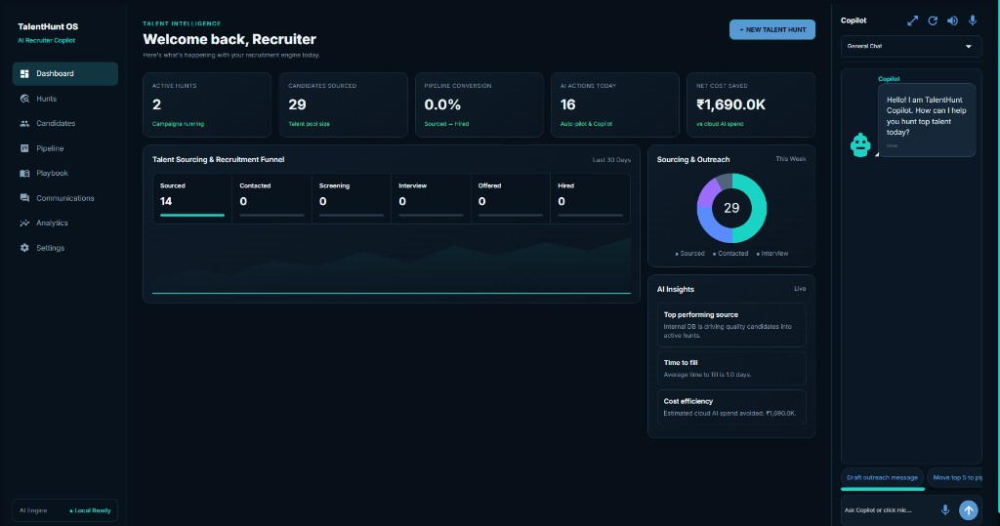
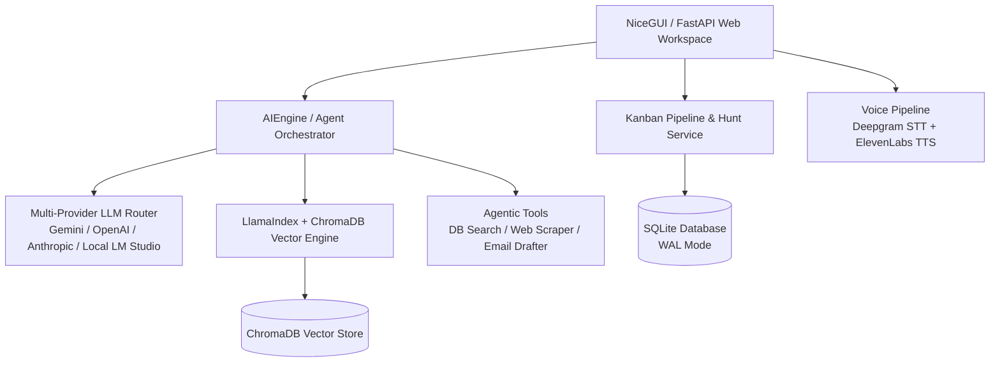

<div align="center">

# 🎯 TalentHunt OS
### *The Intelligent, AI-Native Workspace for Next-Generation Talent Acquisition*

[](https://www.python.org/)
[](https://nicegui.io/)
[](https://www.trychroma.com/)
[](LICENSE)

*Behind every resume is a human story. Behind every company is a mission waiting for the right person.*  
**TalentHunt OS** reimagines recruitment software from the ground up—moving away from slow, clunky legacy ATS tools toward a fast, fluid, dark-mode desktop OS powered by multi-provider AI agents.

<br/>



</div>

---

## ✨ Why TalentHunt OS?

Modern hiring is broken by noise. Recruiters spend hours manually filtering spreadsheets, copy-pasting candidate notes, and toggling across dozens of browser tabs.

**TalentHunt OS** was built to eliminate administrative friction so founders, agency teams, and recruiters can focus on what actually matters: **building real relationships with exceptional people**.

### 🌟 Key Highlights

- 🎯 **Talent Hunts (Campaigns)**: Focus your search around specific impact goals, technical criteria, and compensation parameters.
- 🤖 **AI Auto-Pilot Sourcing**: Automatically matches candidate pools against campaign criteria using semantic vector search and multi-dimensional scoring.
- 💬 **Context-Aware AI Copilot**: A built-in assistant that understands your active hunt context, answers natural language queries about candidates, executes database tools, and conducts real-time web research.
- 📊 **Kanban Pipeline & 360° Candidate DNA**: Seamless drag-and-drop candidate progression with rich work history, skill tags, and recruiter notes.
- 🎙️ **Voice Bridge**: Hands-free voice operation powered by Deepgram STT and ElevenLabs TTS.
- 🔒 **Privacy-First & Local-Ready**: Supports local LLMs (LM Studio, Ollama) alongside cloud providers (Gemini, OpenAI, Anthropic), with SQLite + ChromaDB local storage.

---

## 🎨 Design Philosophy

TalentHunt OS features a custom **Recruiter OS Dark Carbon** design system engineered for high readability during long sourcing sessions:

| Token | Hex | Role |
| :--- | :--- | :--- |
| **Canvas** | `#050607` | Deep obsidian background for minimal eye strain |
| **Containers** | `#0B0D0F` | Structured workspace boundaries |
| **Cards** | `#121619` | Elevated card surfaces with subtle `#1E2226` borders |
| **Accent** | `#3ED9A6` | Vibrant mint accent for primary actions and active indicators |

---

## 🏗️ Architecture Overview



---

## 🚀 Quick Start

### Prerequisites
- **Python 3.12+** installed
- Git
- [uv](https://docs.astral.sh/uv/) for the locked project environment

### 1. Clone the Repository
```bash
git clone https://github.com/Saurabh682/TalentHuntOS.git
cd TalentHuntOS
```

### 2. Set Up the Locked Environment
```powershell
.\scripts\setup.ps1
```

The setup command creates an isolated `.venv`, installs the exact dependency graph
from `uv.lock`, and installs Playwright Chromium. It does not use or modify global
Python packages.

### 3. Configure Environment Variables
Create a `.env` file in the root directory:
```env
# AI Provider Keys (Optional: local fallback will be used if omitted)
GEMINI_API_KEY=your_gemini_key_here
OPENAI_API_KEY=your_openai_key_here

# Voice Keys (Optional)
DEEPGRAM_API_KEY=your_deepgram_key_here
ELEVENLABS_API_KEY=your_elevenlabs_key_here

# App Config
HOST=127.0.0.1
PORT=8080
```

### 4. Launch TalentHunt OS
```powershell
uv run python -m app.main
```
Open your browser and navigate to **`http://127.0.0.1:8080`**.

---

## 🗺️ Roadmap & Vision

The detailed control-plane audit and implementation sequence is maintained in
[TalentHunt OS Copilot-First Roadmap](docs/COPILOT_FIRST_ROADMAP.md).

- [x] **v0.1 Core Foundation**: Kanban pipeline, 360° candidate CRM, AI Auto-pilot, vector search, copilot chat persistence.
- [ ] **Multi-Channel Web Sourcing Agent**: Autonomous sourcing across GitHub, LinkedIn, and public developer profiles.
- [x] **SMTP Outbound Delivery**: Encrypted local account configuration, connection testing, and honest send status.
- [ ] **IMAP Inbox Sync**: Authenticated reply detection and inbox synchronization.
- [ ] **Resume Parser**: PDF/Docx drag-and-drop parsing into structured candidate profiles.
- [ ] **Team Collaboration**: Shared hunt workspaces and candidate evaluation rubrics.

---

## 🤝 Contributing

We believe great tools are built by communities who care deeply about candidate experience and recruiter productivity. 

Whether you want to fix a bug, enhance the UI, add a new AI tool, or improve documentation—**your contributions are warmly welcome!**

1. **Fork** the repository
2. **Create** your feature branch (`git checkout -b feature/AmazingFeature`)
3. **Commit** your changes (`git commit -m 'Add some AmazingFeature'`)
4. **Push** to the branch (`git push origin feature/AmazingFeature`)
5. Open a **Pull Request**

---

## 📄 License

Distributed under the MIT License. See `LICENSE` for more information.

<div align="center">
  <sub>Built with ❤️ for recruiters, founders, and talent builders everywhere.</sub>
</div>
